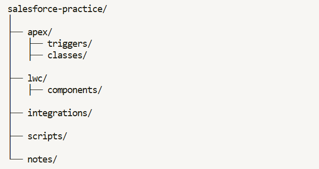

# 🚀 Salesforce Development Practice

This repository documents my **Salesforce Development learning journey** through hands-on practice.

The goal is to build a **strong foundation in Salesforce development and integrations** by solving practical problems, implementing features, and experimenting with the Salesforce platform.

Instead of only consuming tutorials, I focus on **learning by building and practicing**.

## 🎯 Objectives

*   Strengthen core **Salesforce development skills**
*   Practice **Apex, LWC, SOQL, and Platform features**
*   Understand **real-world implementation patterns**
*   Improve **problem-solving and debugging skills**
*   Document learning progress consistently

## 🧠 Learning Approach

My learning approach is based on **deliberate practice**:

1.  Pick a concept or problem
2.  Implement the solution in code
3.  Test the implementation
4.  Commit the working solution
5.  Document key learnings

Each commit represents **a small step of progress in mastering Salesforce development**.

## 🛠️ Topics Covered

This repository will include practice related to:

*   Apex Programming
*   Lightning Web Components (LWC)
*   SOQL & SOSL
*   Triggers
*   Asynchronous Apex
*   Salesforce Integrations
*   Salesforce CLI & DX
*   Governor Limits
*   Security & Sharing
*   Unit Testing

More topics will be added as my learning progresses.

## 📂 Repository Structure

## ⚙️ Tools & Technologies

* Salesforce Platform
* Apex
* Lightning Web Components (LWC)
* SOQL / SOSL
* Salesforce CLI (sf)

## 📈 Learning Philosophy

> Mastery comes from consistent deliberate practice.

This repository is part of my long-term commitment to becoming an **advanced Salesforce developer and integration specialist**.

## 🔗 Connect With Me

If you are also learning Salesforce or want to collaborate:

*   LinkedIn: [https://www.linkedin.com/in/kapiljoshi07/](https://www.linkedin.com/in/kapiljoshi07/)
*   Trailblazer: [https://www.salesforce.com/trailblazer/kapiljoshi07](https://www.salesforce.com/trailblazer/kapiljoshi07)
    

### ⭐ If you find this repository helpful, feel free to star it.
